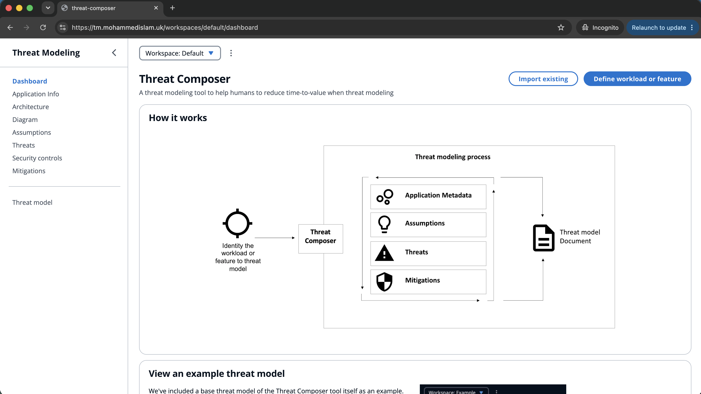
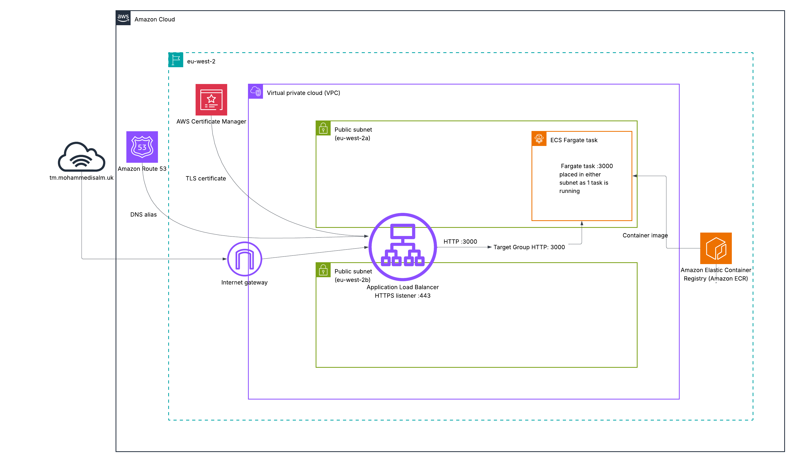

# AWS ECS Deployment Project

This project deploys the AWS Threat Composer app to AWS using ECS Fargate.

The infrastructure is provisioned with Terraform and includes a custom VPC, 2 public subnets, an Application Load Balancer, HTTPS using ACM, Route 53 DNS, ECR to store Docker images, and ECS Fargate for running the app.

CI/CD is implemented using GitHub Actions with OIDC authentication to AWS. 

Images are built and tagged with the Git commit SHA before being pushed to ECR via the 'application' pipeline.

Separate Terraform pipelines deploy and destroy the infrastructure.

## App Demo

Here you can see the app is publicly visible on https://tm.mohammedislam.uk



## Local Setup

1. Clone this repo

```bash
git clone https://github.com/mohammed-972/ecs-project
```

2. Build Docker image

```bash
docker build -t threat-composer ./app
```

3. Run container

```bash
docker run -p 3000:3000 threat-composer
```

4. View app

Open: http://localhost:3000

5. Health check

Run the following command

```bash
curl -i http://localhost:3000/health
```




## Architecture Diagram

.
├── app/
│   ├── Dockerfile
│   ├── server.js
│   ├── package.json
│   └── src/
├── infra/
│   ├── backend.tf
│   ├── main.tf
│   ├── provider.tf
│   ├── route53.tf
│   ├── variables.tf
│   └── module/
│       ├── acm/
│       ├── alb/
│       ├── ecr/
│       ├── ecs/
│       ├── iam/
│       ├── security_groups/
│       └── vpc/
├── .github/
│   └── workflows/
│       ├── application.yml
│       ├── terraform-deploy.yml
│       └── terraform-destroy.yml
├── images/
└── README.md

