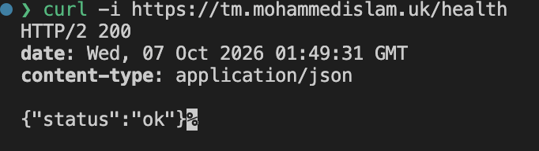
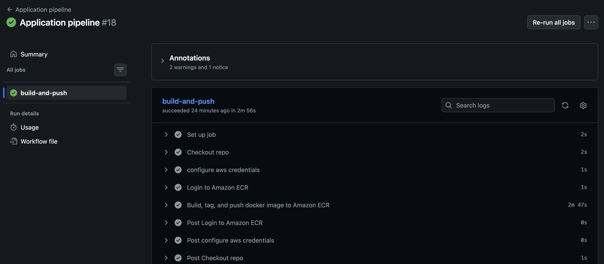
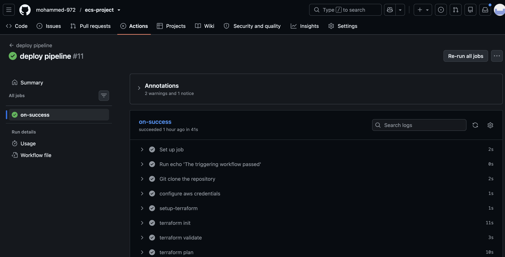
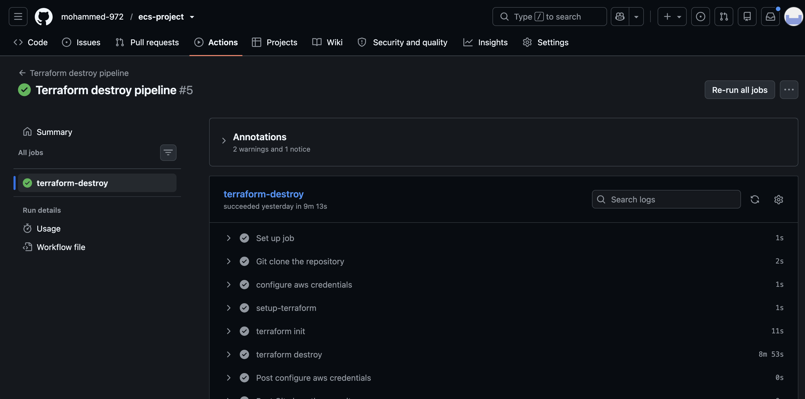

# AWS ECS Deployment Project

This project deploys the AWS Threat Composer app to AWS using ECS Fargate.

The infrastructure is provisioned with Terraform and includes a custom VPC, 2 public subnets, an Application Load Balancer, HTTPS using ACM, Route 53 DNS, ECR to store Docker images, and ECS Fargate for running the app.

CI/CD is implemented using GitHub Actions with OIDC authentication to AWS. 

Images are built and tagged with the Git commit SHA before being pushed to ECR via the 'application' pipeline.

Separate Terraform pipelines deploy and destroy the infrastructure.

## App Demo

Here you can see the app is publicly visible on https://tm.mohammedislam.uk


Manual health check, by running

```bash
curl -i https://tm.mohammedislam.uk/health
```



## Local Setup

1. Clone this repo

```bash
git clone https://github.com/mohammed-972/ecs-project
cd ecs-project
```

2. Build Docker image

```bash
docker build -t threat-composer ./app
```

3. Run container

```bash
docker run -p 3000:3000 threat-composer
```

4. View app

Open: http://localhost:3000

5. Health check

Run the following command

```bash
curl -i http://localhost:3000/health
```


## Bootstrap / First Deployment

Initially or after the entire infrastructure is destroyed, the ECR repository must be recreated before the application pipeline can push a Docker image.

From the `infra/` directory:

```bash
terraform init
terraform apply -target=module.ecr
```

## Architecture Diagram


## Project Structure

```
ecs-project
├── app/
│   ├── Dockerfile
│   ├── server.js
│   ├── package.json
│   └── src/
├── infra/
│   ├── backend.tf
│   ├── main.tf
│   ├── provider.tf
│   ├── route53.tf
│   ├── variables.tf
│   └── module/
│       ├── acm/
│       ├── alb/
│       ├── ecr/
│       ├── ecs/
│       ├── iam/
│       ├── security_groups/
│       └── vpc/
├── .github/
│   └── workflows/
│       ├── application.yml
│       ├── terraform-deploy.yml
│       └── terraform-destroy.yml
├── ecs-images/
└── README.md
```

## Application Pipeline



The Application Pipeline can be triggered manually or automatically when files inside the `app/` directory are changed and pushed to the `main` branch.

The pipeline authenticates to AWS using OIDC, logs in to Amazon ECR, builds the Docker image, tags it with the Git commit SHA, and pushes the image to the ECR repository.


## Deploy Pipeline



The Deploy Pipeline is triggered manually using GitHub Actions.

When starting the workflow, an ECR image tag must be provided. The image tag is the Git commit SHA used by the Application Pipeline when the image was pushed to ECR.

The pipeline authenticates to AWS using OIDC, sets up Terraform, initialises the S3 remote backend, validates the Terraform configuration, creates a Terraform plan using the selected image tag, and applies that saved plan.


## Destroy Pipeline



This pipeline is triggered manually using Github actions. The pipeline authenticates to AWS, initialises Terraform and destroys the Terraform infrastructure.